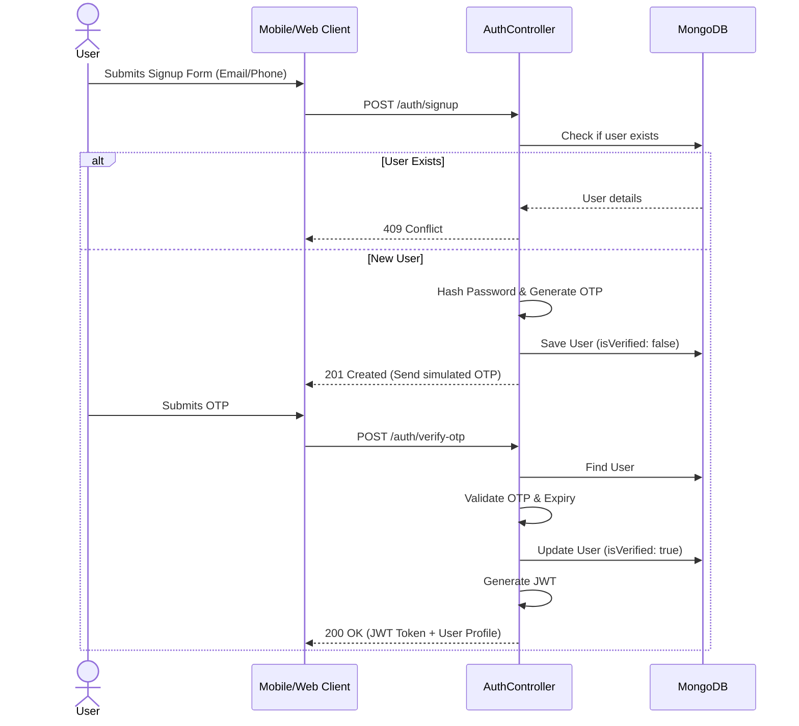
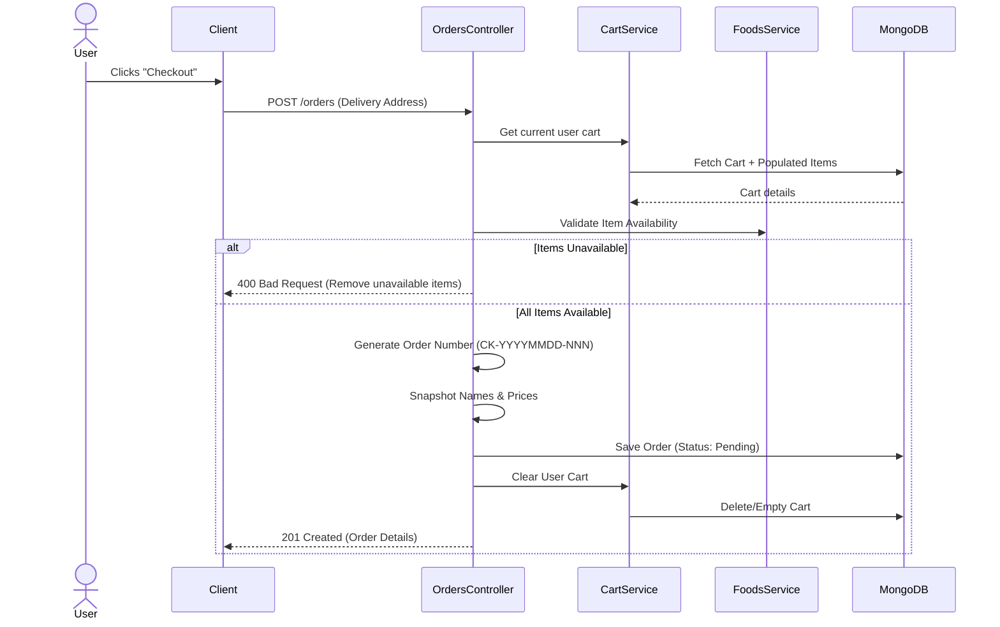
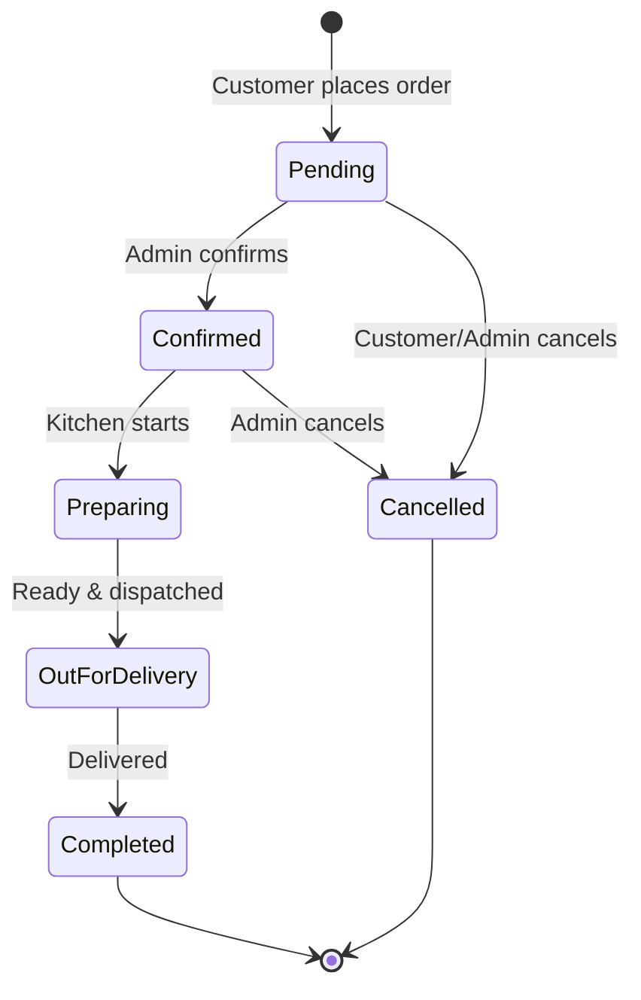

# Backend Flow Diagrams

The following diagrams illustrate the sequence of operations for key use cases in the Chuks Kitchen API.

## 1. User Registration & Verification Flow

## 2. Order Creation Flow

## 3. Order Status Lifecycle (Admin)

